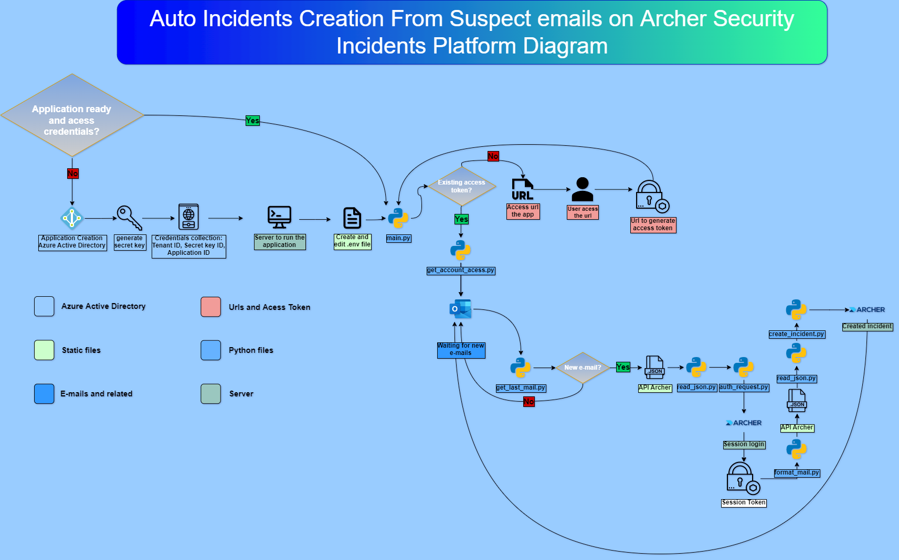

[Archer]: https://www.archerirm.com/
[Python]: https://www.python.org/
[python-o365]: (https://github.com/O365/python-o365)
[Microsoft Graph API]: (https://docs.microsoft.com/pt-br/graph/overview)
[Antonio Costa]: (https://github.com/Antonio-Costa00)
[portal azure]: (https://portal.azure.com/#home)

# Auto Incidents Creation From Suspect New Suspect Emails on Archer Security Incidents Platform 



This project aims to automate the process of creating new incidents on [Archer] security incidents platform by collecting suspicious e-mails from a mailbox and creating a new incident report on the platform, with all required fields covered by the automation

Solution created using [Python] Language, [Microsoft Graph API], [python-o365] library to collect e-mails and acess mailbox and [Archer] API to open new incidents on the platform.

## Author

👤 **Antonio Costa**

* Github: [@Antonio-Costa00](https://github.com/Antonio-Costa00)
* Linkedin: [@Antonio Costa](https://www.linkedin.com/in/antonio-costa-099ab0182/)

## Contributing

Contributions, issues and feature requests are welcome!

## Show your support

Give a ⭐️ if this project helped you!

## License

Copyright © 2022 [Antonio Costa](https://github.com/Antonio-Costa00).<br/>
This project is [MIT](https://github.com/Antonio-Costa00/Calculus-exercises/blob/main/LICENSE) licensed.

## Index

- [Creating an application on Microsoft Azure](#application)
- [Access to services](#application_acess)

## Creating an application on Microsoft Azure <a name = "application"></a>

Creating the application it's necessary to enable the reading permission of user's email.

With the creation of the application, it's possible to read any email account within the box, only possessing the application ID, the tenant ID and the secret key ID.*

**Note**: Only Azure administrators can create new applications unless the permission of creating new applications has been released to users.*

For app creation, the following steps should be followed:

- [1 - Application creation on Microsoft Azure](#new_application)
- [2 - Generating a Secret Key](#secret_key)
- [3 - Setting application](#set_app)
- [4 - Start application](#start_app)

### 1 - Application creation on Microsoft Azure <a name = "new_application" ></a>

For access to email, it's necessary to create an application in Microsoft Azure Directory, with application permission to access the email reading permittions

For app creation, the user must follow the following steps:

1. Access [portal azure]

1. Access Azure Active Directory

1. Application registration

1. Give a name to the application

1. In types of accounts supported, select Accounts in this organizational directory only (*tenant name* only - Single tenant)

**Note:**

- Selecting Accounts in this organizational directory only (*tenant name* only - Single tenant) only tenant accounts can access the app 

- If someone outside the tenant tries to acess the application, the follow error will be generated: "You cannot sign in here with a personal account. Instead, use your school or professional account."

1. Selecting Platform, Web Application

1. Within url redirecting, select the address https://login.microsoftonline.com/common/oauth2/nativeclient

1. Register the app

1. Collect the application ID (client) and the tenant ID (directory).

### 2 - Generating a secret key <a name = "secret_key"></a>

1. On app registrations, Certificates & secrets 
1. New client secret
1. Select a validate time
1. Add
1. Copy the value of ID¹

*² The value of the ID is only possible to preview once, so the value of the ID should be collected immediately after the creation of it.* 

### 3 - Adding new permissions <a name = "new_permissions"></a>

1. API permissions
1. Add a permision
1. Microsoft Graph
1. Delegated permissions
1. Search for *mail* and select All Read permissions that you want.
1. Add permissions.

## Setting application <a name = "set_app"></a>

- [1 - Edit environment file](#edit_env)
- [2 - Archer API](#Archer_API)

### 1 - Edit environment file <a name = "edit_env"></a>

1. Create a file named .env
1. Copy all content from .env.example to .env file
1. Edit the .env environment file
1. Within the file, edit the APPLICATION_ID, SECRET_ID and TENANT_ID values, with the collected values of the creation of the application.
1. Also edit the ACCOUNT_TO_ACESS variable with the email address to be read.¹

*¹This option it's necessary on case the mail is a shared mail*

### 2 - Archer API <a name = "Archer_API"></a>

There is a Archer API file .json on ./Archer/ArcherAPI/example_API.json

You must replace the API with informatios from your Archer System.


## Start application <a name = "start_app"></a>

After following the previous steps, we need to install the project dependencies

```
pip3 install -r requirements.txt
```

If you want to run the application in a simple way you can run the command

```
python3 main.py
```

If you want your application to run as a background process:

```
sh start_restart_application.sh
```

This script will start to run the application as a background process.

**OBS**: 

- At the moment, this solution only runs on Linux servers, and in the future I will create an equal Windows solution.

At the first time you run your application a message asking for an access token will emerge.

```
https://login.microsoftonline.com/...
Paste the authenticated url here:
```

1. To add acess the mailbox, you must acess the link token generated on the terminal screen
1. If it is the first time accessing the application, it will be asked about what the app wants to do, and in our case, perform the reading of the mailbox.
1. If you are repeating the process, nothing will be erased.
1. In both cases, a new url will be generated in the browser.
1. Collect the URL and paste the terminal.
1. If all happened well, the following message would appear in the terminal.

```
Authentication Flow Completed. Oauth Access Token Stored. You can now use the API.
```

For this project, after the 90 days, a new access token must be generated, repeating the errors of the previous session.

And now everytime the mailbox receives a new email automatically the solution will create a new incident on Archer platform

If you don't want to follow this 90 days rule, feel free to read the [oficial](https://github.com/O365/python-o365) documentation.

## References

### Oficial documentation <a name = "oficial_doc"></a>

### [python-o365](https://github.com/O365/python-o365)
