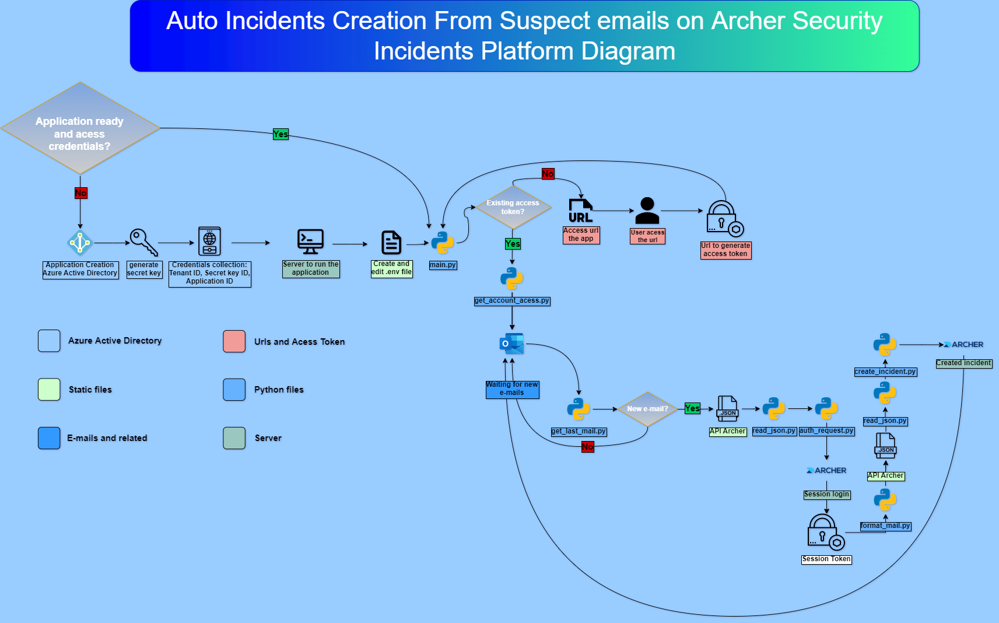

# Automated Security Incident Creation from Suspicious Emails



This project automates the creation of security incidents in the Archer Security Incidents platform.

The application monitors a mailbox for suspicious emails, processes the relevant message data, and creates a new incident in Archer with the required information.

## Overview

The solution integrates:

- Microsoft Graph API for mailbox access;
- Python for the automation workflow;
- `python-o365` for Microsoft 365 authentication and email processing;
- Archer API for incident creation;
- OAuth 2.0;
- Linux for application execution.

The workflow is designed to reduce manual effort in security operations and standardize the creation of incidents from suspicious emails.

## Main Workflow

1. Authenticate the application with Microsoft Azure and Microsoft Graph.
2. Monitor the configured mailbox for new suspicious emails.
3. Retrieve and process the email content.
4. Extract the relevant incident information.
5. Authenticate with Archer.
6. Create a new security incident through the Archer API.
7. Continue monitoring the mailbox for new messages.

## Technologies

- Python
- Microsoft Graph API
- `python-o365`
- Archer API
- OAuth 2.0
- Microsoft Azure
- Linux
- JSON
- Shell Script

## Project Structure

```text
.
├── Archer/
│   └── ArcherAPI/
├── .env.example
├── main.py
├── get_account_access.py
├── get_last_mail.py
├── read_json.py
├── auth_request.py
├── format_mail.py
├── create_incident.py
├── requirements.txt
├── start_restart_application.sh
└── Diagram.png
```

## Prerequisites

Before running the application, make sure you have:

- Python 3 installed;
- access to a Microsoft Azure tenant;
- permission to register an application in Azure;
- access to the target mailbox;
- access to the Archer environment;
- the required Archer API information;
- a Linux server or Linux-based environment.

## Azure Application Setup

Create an application registration in Microsoft Entra ID, formerly known as Azure Active Directory.

The exact permissions depend on the deployment model and the mailbox being accessed.

For unattended automation or shared mailboxes, Microsoft Graph application permissions may be required. These permissions generally require administrator consent.

Use the principle of least privilege and grant only the permissions required by the deployment.

Official documentation:

- [Microsoft Graph overview](https://learn.microsoft.com/en-us/graph/overview)
- [Microsoft identity platform documentation](https://learn.microsoft.com/en-us/entra/identity-platform/)

### Application Registration

1. Open the [Microsoft Entra admin center](https://entra.microsoft.com/).
2. Go to **App registrations**.
3. Select **New registration**.
4. Define the application name.
5. Select the appropriate account type for the organization.
6. Register the application.
7. Copy the following values:
   - Application (client) ID;
   - Directory (tenant) ID.
8. Create a client secret if required by the selected authentication flow.
9. Store the client secret value securely. It is displayed only once.

### API Permissions

Configure the Microsoft Graph permissions required to read the target mailbox.

Depending on the authentication flow, permissions may be delegated or application-based.

Do not grant broad mailbox permissions unless they are strictly necessary. If possible, restrict access to the specific mailbox used by the automation.

## Environment Configuration

Create a local environment file based on the example:

```bash
cp .env.example .env
```

Update the values according to your environment:

```env
APPLICATION_ID=your-application-id
TENANT_ID=your-tenant-id
CLIENT_SECRET=your-client-secret
ACCOUNT_TO_ACCESS=mailbox@example.com
```

The exact variable names must match the ones expected by the application.

Never commit `.env`, credentials, tokens, or real API configuration files to the repository.

Make sure the environment file is included in `.gitignore`.

## Archer API Configuration

The repository contains an example Archer API configuration:

```text
Archer/ArcherAPI/example_API.json
```

Replace the example values with the configuration required by your Archer environment.

Do not commit:

- Production URLs;
- API credentials;
- session tokens;
- tenant-specific identifiers;
- customer information;
- real email content;
- confidential Archer configuration.

Use sanitized example values when sharing the project publicly.

## Installation

Install the Python dependencies:

```bash
python3 -m pip install -r requirements.txt
```

For production environments, using a virtual environment is recommended:

```bash
python3 -m venv .venv
source .venv/bin/activate
python3 -m pip install -r requirements.txt
```

## Running the Application

Run the application directly:

```bash
python3 main.py
```

To start the application using the helper script:

```bash
sh start_restart_application.sh
```

The first authentication may require an interactive browser flow. Follow the URL displayed in the terminal and provide the resulting authorization information when prompted.

After successful authentication, the application can continue monitoring the configured mailbox and creating incidents automatically.

## Authentication and Tokens

The authentication behavior depends on the Microsoft Graph OAuth flow configured for the application.

Some authentication flows require token renewal or user interaction. For unattended production workloads, use an appropriate service-to-service authentication model and follow Microsoft identity platform recommendations.

Tokens and secrets must be stored securely and must never be committed to source control.

## Operational Considerations

For production usage, consider running the application with:

- a dedicated service account;
- restricted filesystem permissions;
- environment variables or a secrets manager;
- structured logging;
- log rotation;
- process supervision through `systemd`;
- monitoring and alerting;
- retry handling for temporary API failures;
- duplicate email and duplicate incident protection.

## Current Limitations

- The current implementation is designed for Linux-based environments.
- Archer API configuration must be adapted to each environment.
- Mailbox and permission configuration depends on the organization.
- Error handling and retry behavior may require additional customization for production use.

## References

- [Archer](https://www.archerirm.com/)
- [Python](https://www.python.org/)
- [`python-o365`](https://github.com/O365/python-o365)
- [Microsoft Graph API](https://learn.microsoft.com/en-us/graph/overview)
- [Microsoft Entra ID documentation](https://learn.microsoft.com/en-us/entra/identity-platform/)

## Author

**Antonio Costa**

- GitHub: [@AntonioJCosta](https://github.com/AntonioJCosta)
- LinkedIn: [Antonio Costa](https://www.linkedin.com/in/dev-antonio-costa/)

## License

This project is licensed under the [MIT License](./LICENSE).
